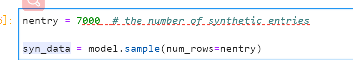
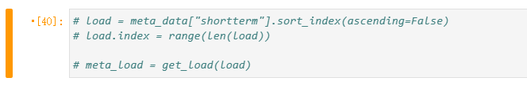

Quickstart:
1.run "pip install -r requirements.txt"
2.unzip our submitted files 
3.enter the unzip directory and open the jupyter notebook "main.ipynb" and run all steps

Parameters setup:
1. Set the parameter nentry for the number of synthetic entries , which is suggested to be less than 7500 entries. 

2. If conditional generation is required, set the condition load for the generation module. The condition load is the time series of the shortterm from the test dataset.
